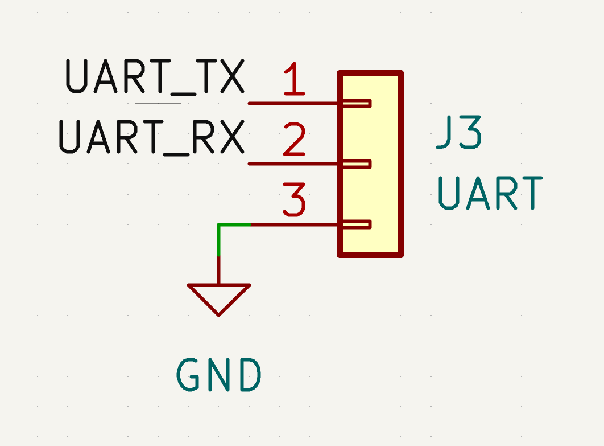
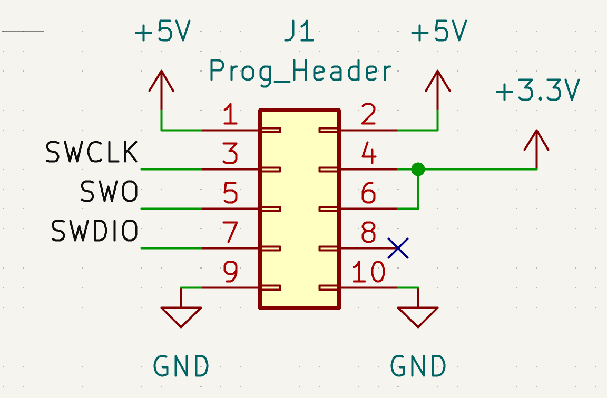
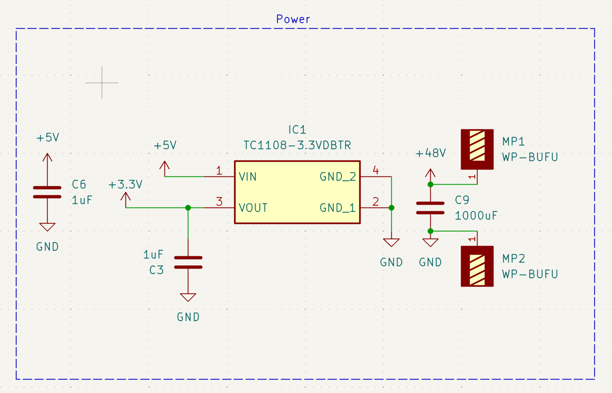
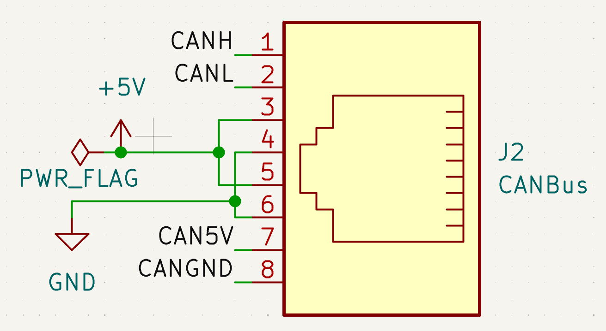

# **Schematic Conventions**

*By: Ethan Rybka*

Please make sure to follow these as close as possible, this will make schematic review much easier for leadership, and help project progress move forwards.

 

# **Introduction**
When doing schematic layout, **consistency** is key to having a readable schematic. This means that you stick to a formatting convention for the whole schematic.

# **Labels**

When using labels use **regular** or **hierarchical** labels. Only use global labels when neccesary. 

### **Naming labels**

When naming labels, do **not** use spaces, use "_" or no space instead. Generally it is best to use all capital letters when naming.

### **Power Labels**

For power labels, GND must always face downwards, and power always upwards. Make sure you are using the built in symbols for these.

# **Structure**

### **Partitions**

Whenever you can, try to group together sets of components together that have similar functionality. For example a buck converter circuit can be inside of one box.
Make sure to label each boxes function. Make sure the box has:

- 8 mil (0.25mm) line width
- Dashed lines
- Use at least 1.5mm (55 mil) text size

## **Sizes**

### **Page Size**

Page size can be any size, although larger sizes will be harder to print, using hierarchical sheets can help to 

### **Text**

Make sure any text follows the above 1.5 mm min text size for readability.

### **Grid** 

Keep the grid size the default size (1.27mm/50mil) if more accurate placement is needed, use half of the size (0.635mm/25mil).

### **Reference Designators & Component Values**

Make sure that components do not have overlapping designators, or component values, this helps with not only readability for you but also for whoever is reviewing your board.

## **EVC Specific Connections**

We have some specific standard layouts for connectors such as the programming headers and CANbus connections, as shown below

  

# **Final Notes**

Just another reminder to be **CONSISTENT** across the entire board. This will make your life easier later on when something breaks and you have to figure why. Something will most likely go wrong the first time, nobody is perfect.

